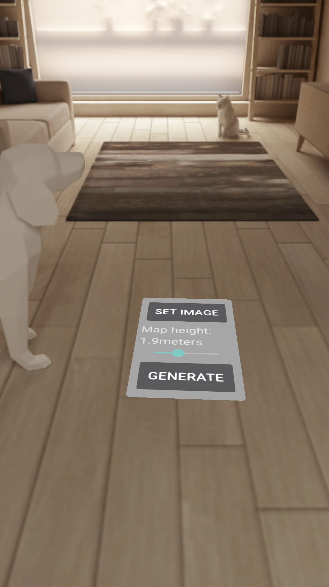

# Augmented and virtual reality technology for biomedical data visualization using Google's ARCore and Sceneform
 
### Getting Started:
These instructions will get you a copy of the project up and running on your local machine for development and testing purposes.

### Prerequisites:
This project will be utilizing Google's ARCore and Sceneform API.

You will need Android Studio version 3.1 or higher, Android SDK Platform version 7.0 (API level 24) or higher, and the Google Sceneform plugin installed. See https://developers.google.com/sceneform/develop/android-quickstart for a detailed guide to preparing your development environment.

To run the project, you will need an AR supported device or the Android Emulator. See https://developers.google.com/sceneform/develop/android-quickstart#prepare-device for a detailed guide to preparing your device.

### Installation:

#### Android Studio:
Step 1: Open the project via File->Open and selecting the [ARCoreDemo](ARCoreDemo) project folder.  
Step 2: Build the app by clicking the build (hammer) button in the toolbar.  
Step 3: Select your AR supported device or emulator.  
Step 4: Run the app by clicking the run (play) button in the toolbar.

### Examples:

  <b>Users can set the image and height of maps.</b> 

  <b>Multiple maps can be shown at once with different sizes.</b> 

  <b>The map can be set to an image stored in the phone's files.</b> 

 
### Built With:
[ARCore](https://developers.google.com/ar)  
[Sceneform](https://developers.google.com/sceneform/develop)  

### Authors:
Wesley Chen - Initial work

### License:
This project is licensed under the MPL License - see the [LICENSE.md](/../LICENSE) file for details

