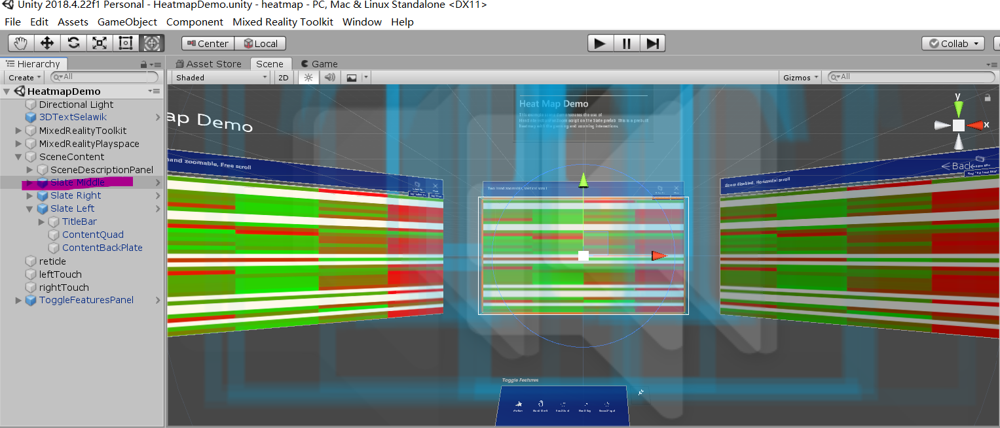
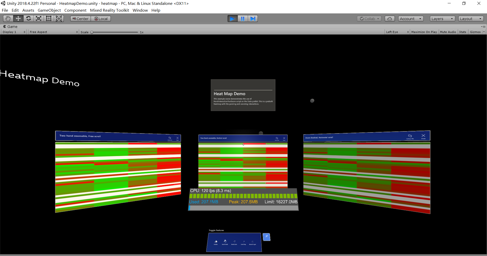

# Augmented and virtual reality technology for biomedical data visualization
 
### Getting Started:
These instructions will get you a copy of the project up and running on your local machine for development and testing purposes. See deployment for notes on how to deploy the project on a live system.

### Prerequisites:
This project will be utilizing Microsoft Hololens as well as IOS ARKit.

Microsoft offers two primary options for Hololens. The first option is purchasing Hololens with Dynamics 365 Remote Assist, which allows for hands-free sharing of visual data. The second option is purchasing the Hololens by itself. 

### Installation:

#### Hololens:

Microsoft Hololens is an extension of the field of AR, and allows one to create digital holograms that can be interacted with in the real world. Holograms are objects that are made out of light and sound, and can both be interacted with via one’s gaze, gestures, and voice commands as well as interact with the environment around it. 

Currently, Microsoft Hololens can be implemented in four different ways: Through Unity, Unreal, JavaScript, and Native.

The quickest development path for a mixed reality app would be through Unity, which is a real-time engine that can be used to develop three-dimensional, VR, and AR simulations and experiences. Microsoft currently has an open source cross-development kit created specifically for Unity called the MRTK v2 with Unity, which is straightforward to set up using their MRTK tutorial. This allows for an automatic setup of your project, as well as options to quickly add mixed reality features to speed up development. For instance, adding support for Windows Mixed Reality features such as spatial stages, gestures, motion controllers, or voice input can be easily implemented using APIs that are already built into Unity. Unity also options to set different tracking room types. To implement the kind of room-scale experience that this project is looking to achieve, Unity’s tracking room type can be set to a standing-scale or room-scale experience. Once a Unity project is properly set-up and ready for implementation, the next step would be to export and build a Unity Visual Studio solution, which Microsoft also offers step-by-step tutorials for. Finally, once a VS studio is ready for deployment, the application can be then run via a Hololens or Windows MR headset, Hololens emulator, or Windows MR headset simulator. 

Unity also offers documentation for Windows MR functionality alongside the Unity editor. For clarification on Unity, it offers a comprehensive manual on anything ranging from basic to advanced techniques on using the platform. Additionally, Unity also offers documentation on the scripting of Unity itself, which is also included on its Unity Editor. 

#### Mobile IOS Development Using IOS ARKit:

Apple’s ARKit is a library that is included in their Software Development Kit (SDK) which allows IOS developers to create augmented reality apps and take advantage of the different hardware and software capabilities of IOS devices. ARKit can be directly implemented through Apple’s native XCode.

To start a new ARKit project, Apple offers a pre-written code template called their Apple ARKit sample which provides a few essential code blocks and is useful for plane detection. Additionally, Apple also offers a native 3D engine called iOS SceneKit. Like most other built-in api’s that Apple has, SceneKit can be easily implemented via a few lines of code that can be found by doing a quick scan of Apple’s documentation. However, a powerful way to take advantage of Apple’s ARKit is through implementation via Unity. 

Unity launcher can be accessed through Apple’s XCode, which has a Unity ARKit plugin built into its asset store. After being downloaded and imported into a project, Unity can be quickly deployed and run via a series of step-by-step tutorials provided by either Unity’s tutorials on the subject or a quick Google search on the subject. 

##### Unity Build Settings:

(Build Settings options in the File menu at the top)
Step 1: To change the specified platform to iOS, click File > Build Settings > select iOS. Check “Development Build” in that window as well, and check “ARKitScene” in the scenes section of the build options.
Step 2: Back to File > Build Settings. Click on “Player Settings,” then “Other Settings (Inspector).” Enter a unique “Bundle Identifier.” Match it with your Company and Product name. Double check that the camera usage description is not blank, then set the target minimum iOS version to 11.0.
Step 3: Go back into Build Settings and click “Build and Run.”
 
##### Final Steps:
Step 1: In the top left, click Build-time, then select the folder Unity-iPhone and look for the "signing" section in the middle pane. Click on "Team" to access the dropdown menu, and select your Apple developer account. If you don't have that option, add one.
Step 2: Underneath that section, in Deployment, select your Apple device (iPhone or iPad). Head to the Product menu and click "Build." After the build is complete, head back to the Product menu and click "Run."
Upon finishing these steps, you should have set up your apple ARKit to be able to start developing mobile apps. After this is accomplished, one can adjust code and add in additional documentation from Apple’s native api’s and libraries to make a unique AR app to their liking.

  <b>Screenshots of a HeatmapDemo in Unity</b> 

### Built With:
[Hololens](https://www.microsoft.com/en-us/hololens/developers)  
[ARKit](https://developer.apple.com/augmented-reality/)

### Contributing:
Please read CONTRIBUTING.md for details on our code of conduct, and the process for submitting pull requests to us.

### Authors:
Bohdan Khomtchouk - Initial work 

### License:
This project is licensed under the MPL License - see the [LICENSE.md](LICENSE) file for details

